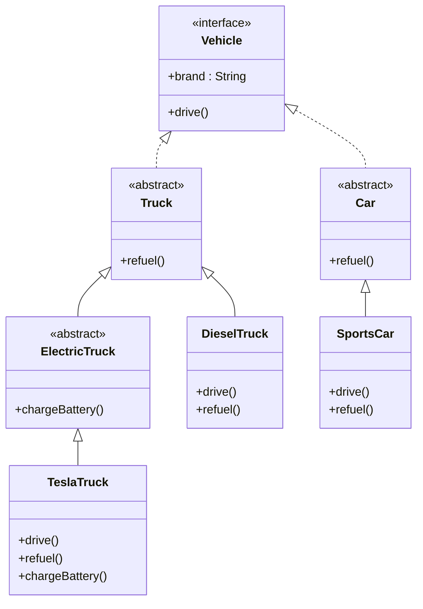
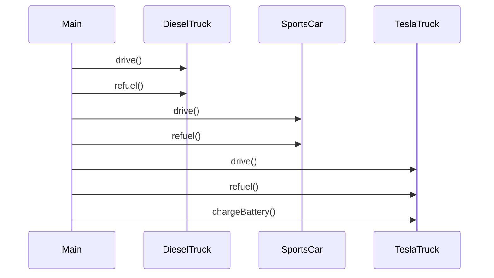

>Ein Unternehmen betreibt verschiedene Fahrzeuge. Du sollst ein Modell entwickeln, das folgende Anforderungen erfüllt:
>- [ ] Jedes Fahrzeug implementiert das Interface `Vehicle`.
>- [ ] Es gibt abstrakte Klassen für `Truck`, `Car` und `ElectricTruck`, die jeweils gemeinsame Logik beinhalten.
>- [ ] Erstelle mindestens eine konkrete Klasse pro abstrakter Klasse: z. B. `DieselTruck`, `SportsCar`, `TeslaTruck`
>- [ ] Implementiere jeweils passende Methoden wie `drive()`, `refuel()`, `chargeBattery()` (bei Elektrofahrzeugen).
>- [ ] Verwende die Objekte in einer Beispiel-Anwendung (`main()`).
>
>**Ziel** Verstehe die Rollen von Interface, abstrakter Klasse und konkreter Klasse.


### Interface
Ein **Interface** ist wie ein **Vertrag** oder eine **rein theoretische Blaupause**.  
Es legt nur fest, **was** eine Klasse tun **muss**, aber nicht **wie**.  
Beispiel: Jedes `Vehicle` muss `drive()` implementieren. _Wie_, bleibt der jeweiligen Klasse überlassen.  
Ein Interface kann von mehreren Klassen gleichzeitig implementiert werden → **Mehrfachvererbung möglich**.

```kotlin
interface Vehicle {
    val brand: String
    fun drive()
}
```

### Abstrakt Klasse
Eine **abstrakte Klasse** ist ein **teilweise ausgefüllter Bauplan**.  
Sie bietet schon **gemeinsame Funktionalität**, zwingt die Unterklassen aber dazu, bestimmte Teile selbst zu definieren.  Man kann sie nicht direkt instanziieren wie ein normales Objekt. 
Sie dient als **gemeinsames Fundament** für konkrete Klassen.

```kotlin
abstract class Truck(override val brand: String) : Vehicle {
    abstract fun refuel()
}

abstract class Car(override val brand: String) : Vehicle {
    abstract fun refuel()
}

abstract class ElectricTruck(override val brand: String) : Truck(brand) {
    abstract fun chargeBattery()
    
    override fun refuel() {  
	    println("$brand Truck doesn't need fuel.")  
	}
}
```

### Konkrete Klassen
Eine **konkrete Klasse** ist ein **fertiges Produkt** auf Basis eines Bauplans.  
Sie erbt die Struktur und Funktionen von einer abstrakten Klasse oder einem Interface und **füllt alle offenen Stellen aus**.  
Erst konkrete Klassen können **Objekte erzeugen**, die man tatsächlich im Code verwenden kann.

```kotlin
// DieselTruck
class DieselTruck(brand: String) : Truck(brand) {
    override fun drive() {
        println("$brand Diesel Truck is driving.")
    }

    override fun refuel() {
        println("$brand Diesel Truck is refueled with diesel.")
    }
}

// SportsCar
class SportsCar(brand: String) : Car(brand) {
    override fun drive() {
        println("$brand Sports Car is driving fast.")
    }

    override fun refuel() {
        println("$brand Sports Car is refueled with petrol.")
    }
}

// TeslaTruck
class TeslaTruck(brand: String) : ElectricTruck(brand) {
    override fun drive() {
        println("$brand Tesla Truck is driving silently.")
    }

    override fun chargeBattery() {
        println("$brand Tesla Truck is charging battery.")
    }
}

//Implementation of Electric Truck with predefined constructor parameter
class MercedesTruck() : ElectricTruck("Mercedes") {  
    override fun drive() {  
        println("$brand Truck is driving silently.")  
    }  
  
    override fun chargeBattery() {  
        println("$brand Truck is charging battery.")  
    }  
}
```

```kotlin
fun main() {
    val vehicles: List<Vehicle> = listOf(
        DieselTruck("MAN"),
        SportsCar("Porsche"),
        TeslaTruck("Tesla"),
        MercedesTruck()
    )

    for (v in vehicles) {
        v.drive()
        when (v) {
            is Truck -> v.refuel()
        }
        if (v is ElectricTruck) {
            v.chargeBattery()
        }
        println()
    }
}
```

### Klassendiagramm

### Sequenzdiagramm

