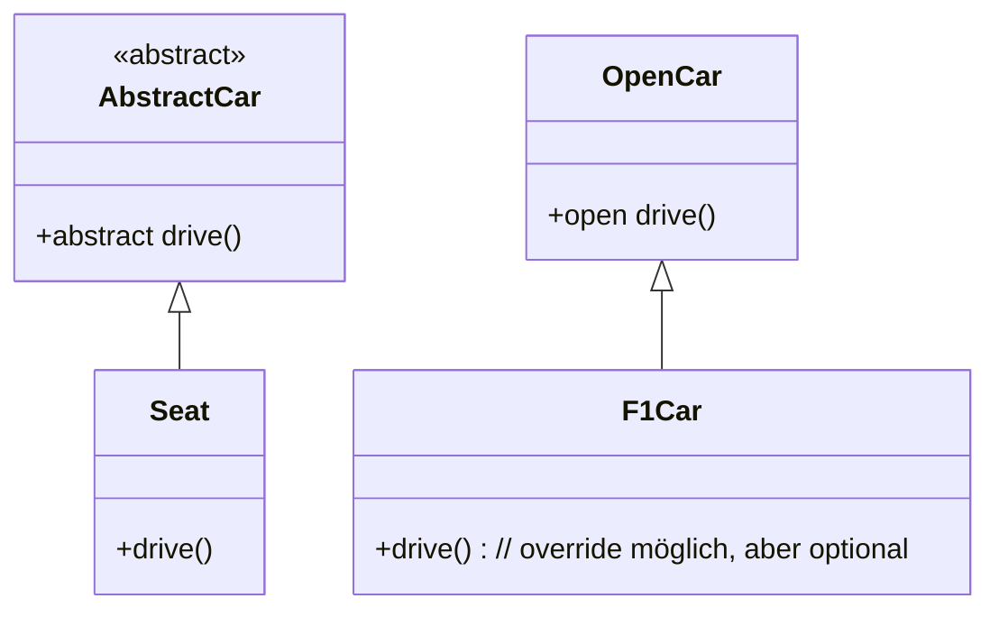

### `abstract fun`

- **Blaupause, kein Körper**:  
    Eine `abstract fun` hat **keine Implementierung** – sie ist quasi nur eine _Signatur_, also eine reine Vorgabe.
    
- **Nur in `abstract class` oder `interface` erlaubt**:  
    Du kannst eine `abstract fun` nicht in einer normalen Klasse definieren.
    
- **Muss von Subklassen überschrieben werden**:  
    Wenn du eine abstrakte Funktion erbst, bist du gezwungen, sie in der Kindklasse zu implementieren.
    

```kotlin
abstract class Car {
    abstract fun drive()
}

class Seat : Car() {
    override fun drive() {
        println("Wrooom")
    }
}
```

Ohne `override fun makeSound()` würde es einen Compilerfehler geben.

---

### `open fun`

- **Hat schon eine Implementierung**:  
    Eine `open fun` ist eine ganz normale Funktion, die **überschreibbar** gemacht wurde.
    
- **Optionales Überschreiben**:  
    Subklassen _können_, müssen aber nicht überschreiben.
    
- **Nur `open` macht Vererbung möglich**:  
    In Kotlin sind Funktionen standardmäßig `final`. Wenn du willst, dass eine Methode überschrieben werden darf, musst du sie mit `open` markieren.
    

```kotlin
open class Car {
    open fun drive() {
        println("Default Wroom")
    }
}

class F1Car : Car() {
    override fun makeSound() {
        println("Wroooooom")
    }
}
```

Hier könnte man die Funktion auch gar nicht überschreiben und einfach den Standard übernehmen.

---
### Kurzvergleich

| Keyword    | Implementierung in Basisklasse? | Muss überschrieben werden? | Darf überschrieben werden? |
| ---------- | ------------------------------- | -------------------------- | -------------------------- |
| `abstract` | Nein                            | Ja                         | Ja                         |
| `open`     | Ja (Standard-Körper)            | Nein                       | Ja                         |

---

