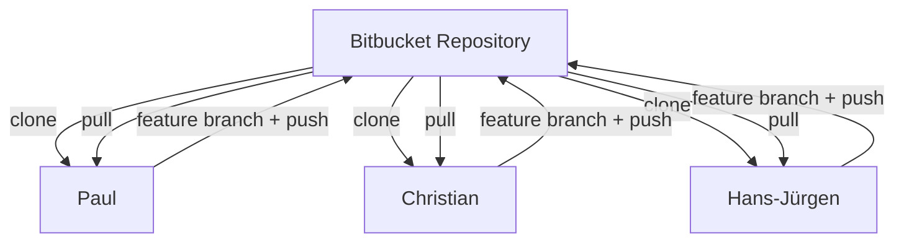

## Was ist Versionskontrolle?

Versionskontrolle ist ein System, das Änderungen an Dateien verfolgt. Sie hilft dabei:
- den Verlauf von Projekten nachzuvollziehen,
- versehentliche Fehler rückgängig zu machen,
- parallel im Team zu arbeiten,
- verschiedene Entwicklungsstände zu verwalten,
- Konflikte zwischen Änderungen zu erkennen und zu lösen.

Gerade in Softwareprojekten ist Versionskontrolle **verpflichtend**, da mehrere Entwickler gleichzeitig am gleichen Projekt arbeiten.

## Was ist Git?

Git ist ein verteiltes Versionskontrollsystem, das lokal auf deinem Rechner arbeitet.  
Es speichert Änderungen als sogenannte **Snapshots** (Zustände des gesamten Projekts).

Wichtige Eigenschaften:
- Jeder Entwickler besitzt das vollständige Repository
- Arbeiten ist auch ohne Internet möglich
- Sehr schnelle Branch- und Merge-Operationen
- Hohe Datensicherheit

Offizielle Dokumentation:  
[https://git-scm.com/docs](https://git-scm.com/docs)

---

## Git ist nicht gleich Bitbucket

|Begriff|Bedeutung|
|---|---|
|**Git**|Das Versionskontrollsystem (lokal installiert)|
|**Bitbucket**|Ein Serverdienst zum Verwalten von Git-Repositories|

Weitere Dienste: GitHub, GitLab

Bitbucket Dokumentation:  
[https://support.atlassian.com/bitbucket-cloud/](https://support.atlassian.com/bitbucket-cloud/)

## Grundprinzip: Wie funktioniert Git?

Git kennt drei zentrale Bereiche:

|Bereich|Beschreibung|
|---|---|
|Working Directory|Deine aktuellen Dateien|
|Staging Area|Vorbereitete Änderungen|
|Repository|Gespeicherte Commits|

### Ablauf:
1. Datei ändern
2. `git add`
3. `git commit`
4. Optional: `git push`

## Was ist ein Repository?

Ein Repository ist ein Projektordner mit:
- allen Dateien
- vollständiger Versionshistorie
- Branches
- Tags

Ein Repository kann:
- lokal liegen
- auf einem Remote-Server (z. B. Bitbucket) liegen

# Wichtige Git-Befehle

|Befehl|Bedeutung|
|---|---|
|`git init`|Neues Repository erstellen|
|`git clone [URL]`|Repository vom Server kopieren|
|`git status`|Aktueller Zustand|
|`git add [Datei]`|Datei zur Staging Area hinzufügen|
|`git commit -m "Nachricht"`|Änderungen speichern|
|`git log --oneline --graph`|Historie anzeigen|
|`git branch`|Branches anzeigen|
|`git switch -c branchname`|Neuen Branch erstellen|
|`git switch branchname`|Branch wechseln|
|`git merge branchname`|Branch zusammenführen|
|`git push`|Änderungen hochladen|
|`git pull`|Änderungen vom Server holen|

# Typischer Git-Workflow im Team

1. Repository klonen
2. Feature-Branch erstellen
3. Änderungen entwickeln
4. Committen
5. Pushen
6. Pull Request erstellen
7. Review & Merge

---

# Praxisbeispiel: Teamarbeit mit Bitbucket

## Team: Paul, Christian, Hans-Jürgen

Repository: `spedion-app`  
Standardbranch: `main`

## Schritt 1 – Alle klonen das Repository

```sh
git clone git@bitbucket.org:team/spedion-app.git
```

## Schritt 2 – Jeder erstellt eigenen Branch

Paul:
```sh
git switch -c feature/login
```

Christian:
```sh
git switch -c feature/recyclerview
```

Hans-Jürgen:
```sh
git switch -c feature/location-update
```

## Schritt 3 – Entwicklung & Commit

Paul:
```sh
git add .
git commit -m "Add login validation"
```

## Schritt 4 – Push zum Server
```sh
git push -u origin feature/login
```

## Schritt 5 – Pull Request in Bitbucket

- Feature-Branch auswählen
- Ziel: `main`
- Code Review
- Merge durchführen

# Merge verstehen

Merge bedeutet:
> Zwei Entwicklungszweige werden zusammengeführt.

Beispiel:
```sh
git switch main
git merge feature/login
```

# Merge Conflict – was ist das?

Ein Merge Conflict entsteht, wenn:
- Zwei Entwickler dieselbe Datei
- in derselben Codezeile
- unterschiedlich geändert haben.

Beispiel Konflikt:
```kotlin
<<<<<<< HEAD
val interval = 5000L
=======
val interval = 10000L
>>>>>>> feature/location-update
```

## Konflikt lösen
1. Entscheiden, welcher Code korrekt ist
2. Marker entfernen
3. Datei speichern
4. Commit abschließen

```sh
git add LocationManager.kt
git commit
```

# Pull vs Fetch

|Befehl|Beschreibung|
|---|---|
|`git fetch`|Holt Änderungen, integriert sie aber nicht|
|`git pull`|Holt und merged automatisch|

# Rebase (fortgeschritten)

Rebase setzt deine Commits auf einen neuen Basis-Commit.
```sh
git rebase main
```

Vorteil:
- lineare Historie

Wichtig:
> Niemals Rebase auf bereits geteilten Branches ohne Absprache!

# SSH vs HTTPS

## HTTPS
```url
https://bitbucket.org/team/spedion-app.git
```

- Einfach
- Benötigt Token/App-Password

## SSH (empfohlen)

`git@bitbucket.org:team/spedion-app.git`

Vorteile:

- Kein Passwort bei jedem Push
    
- Sicherer
    
- Industriestandard
    

---

# SSH-Key einrichten (empfohlen)

## 1. Key generieren
```sh
git@bitbucket.org:team/spedion-app.git
```

## 2. Public Key anzeigen
```sh
cat ~/.ssh/id_ed25519.pub
```

## 3. In Bitbucket einfügen
Bitbucket → Personal Settings → SSH Keys

## 4. Verbindung testen
```sh
ssh -T git@bitbucket.org
```

# Gute Branch-Namen

- `feature/login`
- `feature/location-improvement`
- `bugfix/crash-on-start`
- `hotfix/null-pointer`
- `bugfix/APP-xxx`

# Best Practices im Team

- Niemals direkt auf `main` entwickeln
- Kleine, logische Commits
- Aussagekräftige Commit-Nachrichten
- Vor jedem Push: `git pull`
- Merge Conflicts bewusst lösen
- Pull Requests verwenden

# Typische Fehler vermeiden

- Große unstrukturierte Commits  
- Force Push ohne Absprache  
- Direkt auf main arbeiten  
- Konflikte blind überschreiben  
- Rebase ohne Verständnis

# Diagramm: Team-Workflow



# Selbst-Check

-  Ich verstehe Working Directory, Staging und Repository
-  Ich kann Branches erstellen und wechseln
-  Ich kann Merge Conflicts lösen
-  Ich kenne Pull vs Push
-  Ich weiß, wann ich Rebase nutze
-  Ich kann SSH für Bitbucket einrichten

# Weiterführende Links

- [Git Dokumentation](https://git-scm.com/docs)
- [Git Book](https://git-scm.com/book/en/v2)
- [Bitbucket Dokumentation](https://support.atlassian.com/bitbucket-cloud/)
- [SSH Setup Bitbucket](https://support.atlassian.com/bitbucket-cloud/docs/set-up-an-ssh-key/)


> **Hinweis:** Praktische Übungen wie das gemeinsame Klonen eines Test-Repositories, das Erstellen von Branches und das Durchspielen eines Workflows sollten im Anschluss erfolgen.

