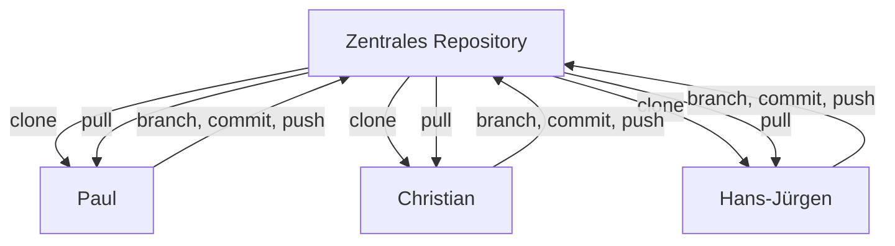

## Was ist Versionskontrolle?
Versionskontrolle ist ein System, das Änderungen an Dateien verfolgt. Sie hilft dabei:
- den Verlauf von Projekten nachzuvollziehen,
- versehentliche Fehler rückgängig zu machen,
- parallel im Team zu arbeiten,
- verschiedene Entwicklungsstände zu verwalten.

## Was ist Git?
Git ist ein verteiltes Versionskontrollsystem, das lokal auf deinem Rechner arbeitet. Es wurde entwickelt, um effizient und sicher Quellcode zu verwalten.

## Git ist nicht gleich GitHub
| Begriff    | Bedeutung                                                                               |
| ---------- | --------------------------------------------------------------------------------------- |
| **Git**    | Das Programm, das lokal auf dem Rechner läuft und Dateien versioniert.                  |
| **GitHub** | Ein Serverdienst, der Git-Repositories online verwaltet und Zusammenarbeit erleichtert. |
Weitere Dienste zum Beispiel: GitLab, Bitbucket

## Wie funktioniert Git?
Git speichert den Projektstand als sogenannte Snapshots. Jeder Commit speichert den Zustand des Projekts. Es gibt einen lokalen und optional einen entfernten (Remote-)Server.
### Lokal vs. Server
- **Lokal:** Git arbeitet hauptsächlich lokal. Jeder Entwickler hat das komplette Repository.
- **Remote:** Git-Server (z. B. GitHub) dienen zur Zusammenarbeit.

## Wichtige Git-Befehle
| Befehl | Bedeutung |
|--------|-----------|
| `git init` | Erstellt ein neues lokales Repository |
| `git clone [URL]` | Klont ein entferntes Repository |
| `git add [Datei]` | Markiert Datei für den nächsten Commit |
| `git commit -m "Nachricht"` | Speichert Änderungen dauerhaft im lokalen Repository |
| `git status` | Zeigt aktuellen Status der Dateien |
| `git log` | Zeigt Verlauf der Commits |
| `git branch` | Listet Branches auf oder erstellt neue |
| `git checkout [branch]` | Wechselt zu einem anderen Branch |
| `git push` | Überträgt Commits zum Remote-Repository |
| `git pull` | Holt und integriert aktuelle Änderungen vom Remote-Repository |

## Typischer Git-Workflow
1. `git clone` Repository vom Server holen
2. `git checkout -b neuer-branch` Neuen Branch erstellen
3. Code ändern
4. `git add .` oder `git add [Datei]`
5. `git commit -m "Beschreibung"`
6. `git push -u origin neuer-branch`

## Was ist ein Repository?
Ein Repository ist ein Ordner mit allen Dateien und dem Versionsverlauf. Es kann lokal oder remote liegen.

## Verbindung zum Server: SSH vs. HTTPS
| Methode   | Beschreibung                                                       |
| --------- | ------------------------------------------------------------------ |
| **HTTPS** | Einfach, braucht bei jedem Push Benutzername + Passwort oder Token |
| **SSH**   | Sichere Verbindung über Schlüsselpaare, nach Einrichtung bequemer  |

## Git Clients
- **Android Studio:** Integrierte Git-Unterstützung (Version Control)
- **GitExtensions:** Windows-Client mit GUI
- **GitKraken:** Moderner Git-Client mit visueller Oberfläche

## Zusammenarbeit im Team
### Beispiel: Paul, Christian, Hans-Jürgen arbeiten zusammen
- Alle klonen das zentrale Repository
- Jeder erstellt eigenen Branch
- Nach der Arbeit: commit & push
- Merge/Review durch Team

### Diagramm: Typischer Team-Workflow

---

> **Hinweis:** Praktische Übungen wie das gemeinsame Klonen eines Test-Repositories, das Erstellen von Branches und das Durchspielen eines Workflows sollten im Anschluss erfolgen.

